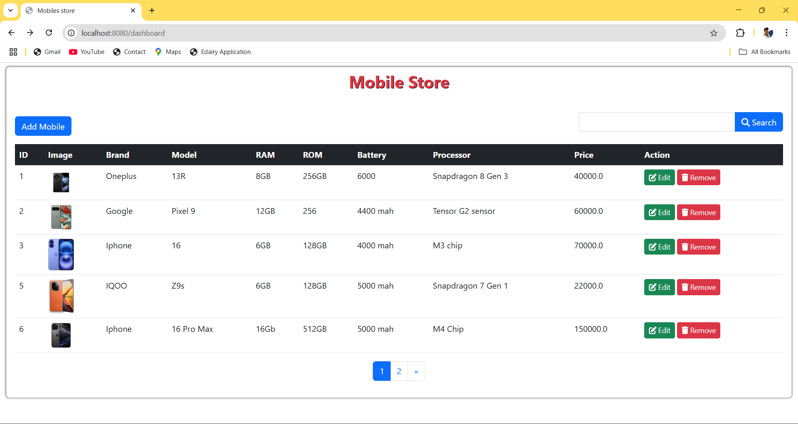
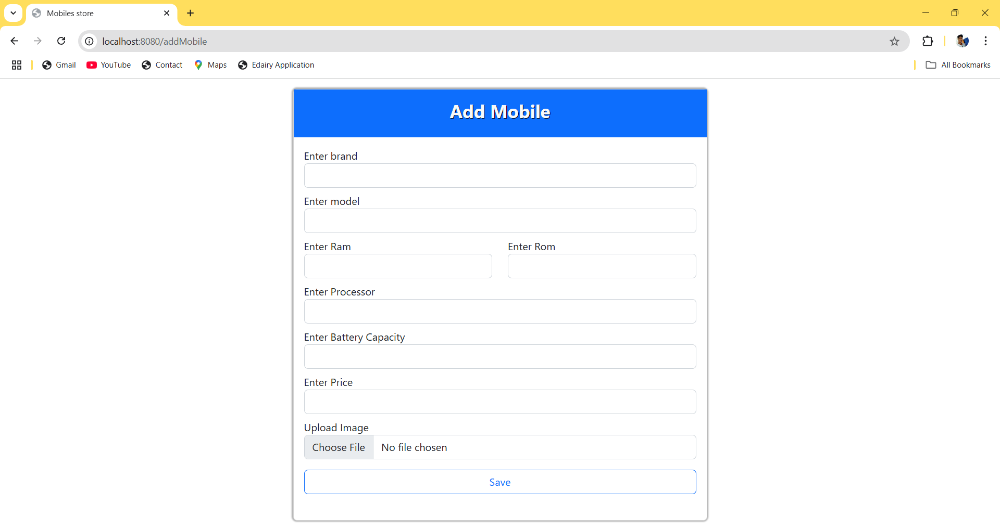
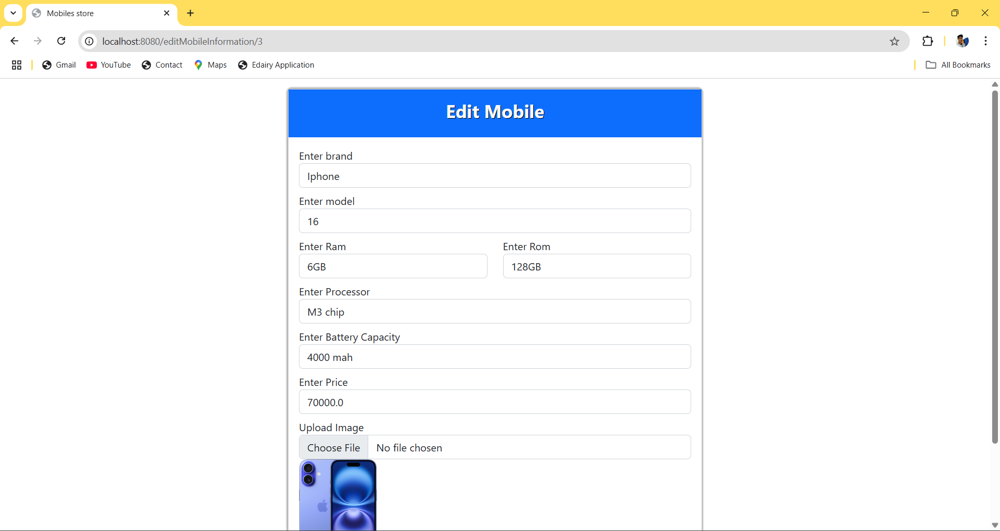
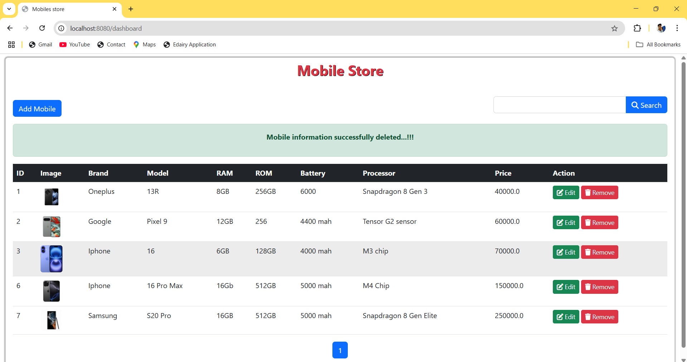

# 📱 Online Mobile Store

---

## 📝 Project Description

**Online Mobile Store** is a full-stack web application that allows users to manage a collection of mobile phones through an intuitive interface. Built using **Java**, **Spring Boot**, **Spring MVC**, **Spring Data JPA**, and **MySQL**, this project features clean UI design using **HTML**, **CSS**, and **Bootstrap**.

---

## 🎯 Features

🔹 Add new mobile details  
🔹 Update existing mobile information  
🔹 Search mobiles by name or model  
🔹 Delete a mobile record  
🔹 View all mobiles with **pagination**  
🔹 Display useful messages using **HttpSession**

---

## 🛠️ Tech Stack

| Layer         | Technology                     |
|---------------|-------------------------------|
| 💻 Frontend    | HTML, CSS, Bootstrap          |
| 🧠 Backend     | Java, Spring Boot, Spring MVC |
| 💾 Database    | MySQL                         |
| 🧰 ORM         | Spring Data JPA               |
| 🌐 Server      | Embedded Tomcat               |
| 🧮 Pagination  | Spring JPA Pageable + UI      |

---

## 🔐 Session Usage

Session is used to:
- ✅ Display confirmation messages after add/update/delete
- ✅ Temporarily store user interaction feedback

---

## 📄 Pagination

Pagination is implemented using:
- `Pageable` from **Spring Data JPA**
- Page navigation UI for better user experience and performance

---

## 📸 Screenshots

### 🔹 Home Page

### 🔹 Add Mobile

### 🔹 Edit Mobile

### 🔹 Delete Mobile

### 🔹 Search Mobiles

---

<h4 align="center"> 💡 Developed with ❤️ using Spring Boot & MySQL </h4>

